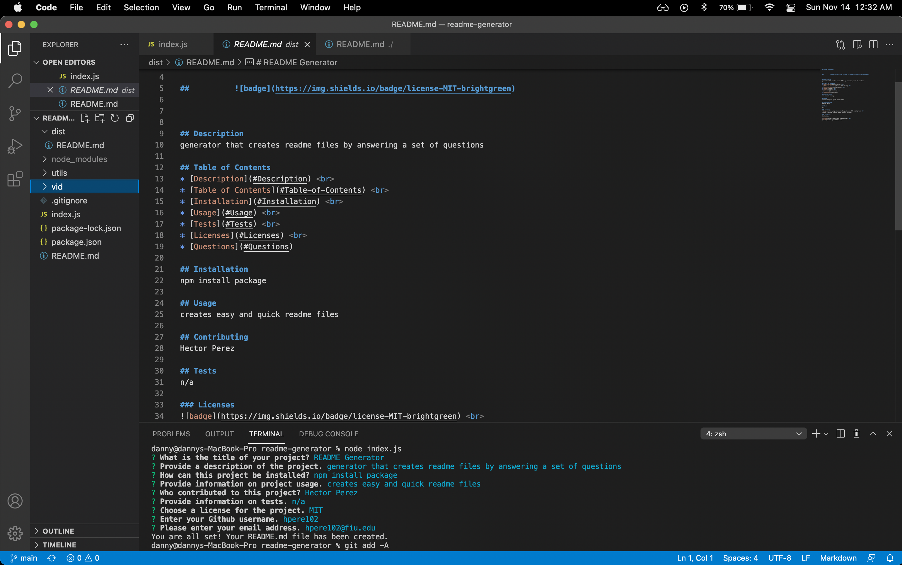

# README Generator

## Description
Generator that creates a readme file by answering a set of questions from the command line
        

## Table of Contents
* [Description](#Description)  
* [Table of Contents](#Table-of-Contents)  
* [Installation](#Installation)  
* [Usage](#Usage)  
* [Contributing](#Contributing)  
* [Tests](#Tests)  
* [Questions](#Questions) 

## Installation
npm install package

## Usage
creates quick and simple readme files

## Contributing
Hector Perez

## Tests
n/a

### Questions
Contact me:

[Github](https://www.github.com/hpere102)  
[Email](mailto:hpere102@fiu.edu)